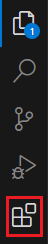
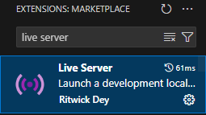
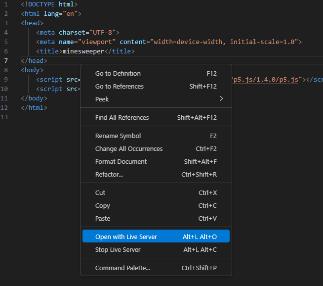
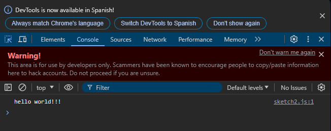

# Learning JavaScript and p5.js
---

## 1.- Set Up Your Environment:

Choose a code editor of your preference. In this guide, we will be using Visual Studio Code. If you don't have it, you can download it for free from the [official website](https://code.visualstudio.com).

In addition, we will be using an extension to view our program in the web browser. To install an extension in Visual Studio Code, follow these steps:

1. Go to the left-hand menu and click on this icon:


2. Search for an extension called "Live Server":


3. Install the extension.

Once we have completed this steps we can start coding our program.

## 2.- Create index.html

The first step is to create the main file that will run in our browser. To do this, create a new file called `index.html`. You can do this by right-clicking on the explorer and selecting "New File." Once the file is created, open it and add the following content:

````html
<!DOCTYPE html>
<html lang="en">
<head>
    <meta charset="UTF-8">
    <meta name="viewport" content="width=device-width, initial-scale=1.0">
    <title>minesweeper</title>
</head>
<body>
    <script src="https://cdnjs.cloudflare.com/ajax/libs/p5.js/1.4.0/p5.js"></script>
    <script src="sketch.js"></script>
</body>
</html>
````

The key part of this file is the content between `<script>` and `</script>`. This specifies that we will be using p5.js and a file named `sketch.js`. If you want to learn more about HTML, you can search for documentation online.

## 3.- Create sketch.js

This file will contain all of our code, so it will be the focus from now on. To start, create a file named `sketch.js`. Add the following code to this file:

````js
console.log("hello world!!!");
````

Now, right-click on your `index.html` file and select "Open with Live Server":



This will open your program in the browser. To view the console, either right-click on the browser and select "Inspect" or press Ctrl+Shift+C. Then, navigate to the Console tab to see your message:



With `console.log("message")`, you can see messages in the console. However, there are many other things we can do in our program. The next step is to create a variable. Variables are one of the most important concepts in programming. In p5.js, there are two main ways to create a variable: `var` and `let`.


Let's try both by adding the following code to `sketch.js`:
````js
var text = "hello world!!!";
let num = 10;

console.log(text + ", num = " + num);
````

As you can see, we can also print variables with `console.log()` and concatenate them to display multiple values at the same time.

The main difference between `let` and `var` is that `let` is more secure and is only visible in the context in which it is created. We will see an example of this later.

## 4.- Conditions and loops

In our program, we will need to make decisions and execute code repeatedly. We can achieve this with `if` conditions and `for` loops. Let's start with conditions:

````js
let num = 10;

if(num == 10){                              // 1
  console.log("is 10");
}
else if(num < 12){
  console.log("less than 12 AND not 10");   // 2
}
if(num != 3){                               // 3
  console.log("not 3");
}
````

In this code, we first create a variable `num` equal to 10. We then compare it to 10 using `==`, the equality operator. If this condition(1) is true, the code inside the `{}` will be executed; otherwise, the program will continue without executing that code.

The else statement is executed only if the preceding if condition is false. In this case, it is combined with an else if statement, so the else block will execute only if the first if condition(1) is false and the else if condition(2) is true.

We can also use the `!=` operator(3), which checks if the right side is different from the left side, as opposed to `==`, which checks for equality.

We can create more complex conditions by using logical operators to combine multiple conditions.
The main logical operators are:

* `&&` (AND): The condition is true only if both conditions are true.
* `||` (OR): The condition is true if at least one of the conditions is true.

We can see this in action with the following code:
````js
let num = 10;
let num2 = 5;

if(num == 10 && num2 == 5){                 // 4
  console.log("num = 10 AND num2 = 5");
}
if(num == 10 || num2 == 8){                 // 5
  console.log("num = 10 OR num2 = 8");
}
````
In this code:

* The first `if` statement(4) uses `&&` to check if both `num` is 10 and `num2` is 5. Since both conditions are true, the message "num = 10 AND num2 = 5" will be logged to the console.
* The second `if` statement(5) uses `||` to check if either `num` is 10 or `num2` is 8. Since `num` is 10, the message "num = 10 OR num2 = 8" will be logged to the console.

There are many operators we can use in addition to the ones mentioned. These include comparison operators such as:
* < (less than)
* \> (greater than)
* <= (less than or equal to)
* \>= (greater than or equal to)
* == (equal to)
* != (not equal to)

These operators help us build more precise conditions in our code.

Now we can start looking into loops. To begin, let’s look at a simple example using a for loop:

````js
for(let i=0; i<10; i++){
  console.log(i);
}
````

In this code:

* `for` is the loop keyword.
* `let i = 0` initializes the loop variable `i` to 0. Here, we can observe the use of `let` in the context of the `for` loop. The variable `i` declared with let is only accessible within the scope of the `for` loop. This means that `i` cannot be accessed outside the loop..
* `i < 10` is the condition that continues the loop as long as `i` is less than 10.
* `i++` increments `i` by 1 after each iteration.

This loop will execute the code inside the {} block 10 times, with `i` taking values from 0 to 9. Each value of `i` will be printed to the console.

Loops are useful for executing a block of code multiple times and can simplify repetitive tasks.

## 5.- Arrays

Now we can start working with more complex variables. One of the main types of variables we'll use in this code are arrays. An array is a collection of variables that are all contained within a single variable. You can create and visualize the contents of an array with the following code:

````js
let array = [1, 2, 4, 3, 7];

console.log(array[0]);      // 1
console.log(array.length);  // 5
for(let i=0; i<array.length; i++){
  console.log(array[i]);    // 1, 2, 4 ...
}
````

In this code:

* `let array = [1, 2, 4, 3, 7];` creates an array containing five numbers.
* `array[0]` accesses the first element of the array, which is 1.
* `array.length` returns the number of elements in the array, which is 5.

The `for` loop iterates over the array from the first element to the last, printing each value to the console. The `array.length` property is used to determine the number of iterations.

Arrays are useful for storing and managing collections of related data in a single variable.

Later, we will explore how to store arrays inside arrays. This concept is known as a "two-dimensional array" or a "nested array." It allows you to create more complex data structures.

## 6.- Functions

A key concept in programming is the function. A function is a block of code designed to perform a specific task and can be executed at any time from other parts of your program. Functions help to organize and reuse code efficiently.

To create a function in JavaScript, you use the following syntax:

````js
function function_name(){
  console.log("hello from function_name");
}
````

To call the function, simply use its name followed by parentheses:

````js
function_name();
````

Functions can also accept parameters as input. Parameters allow you to pass values into the function to be used within its code. Here’s an example:

````js
function show_text(text){
  console.log(text);
}

show_text("hello");
````

In this example:

* `function show_text(text)` defines a function named show_text that takes one parameter called text.
* `console.log(text);` prints the value of text to the console.
* `show_text("Hello");` calls the function with the argument `"hello"`, which gets passed to the `text` parameter and printed.

Functions are a fundamental building block in programming, helping to organize and reuse code effectively.

## 7.- p5.js

Now that we have a basic understanding of programming, we can start working with p5.js. p5.js is a JavaScript library designed to make it easy to create visually engaging programs. It simplifies the process of drawing and animating on the web.

p5.js provides several predefined functions that you can use to build your programs. The first of these functions is:

````js
function setup(){
  canvas = createCanvas(400, 400);
}
````

This special function is called once when the program starts, right after the web page loads. It is used to initialize variables, set up the canvas, and perform other setup tasks that need to be done once at the beginning.

The `createCanvas` function is used to create a canvas, which is the area where all of our visual content will be drawn and displayed. The canvas acts as a drawing surface for your program. In this case, we are setting the canvas to be 400 pixels wide and 400 pixels tall.

Another function that we will be using is the `draw` function. This function is called continuously, once every frame, and it is where you will place the main components of your program that need to be updated or redrawn regularly.

````js
function draw(){
  background(0); // 0 -> black / 255 -> white
}
````

In this case, we are creating a background that is drawn every single frame. We are using the color black, represented by the value 0, but you can use any color you want.

The parameter 0 corresponds to black, and 255 would correspond to white. You can use any value between 0 and 255 to create different shades of gray, or use RGB values to specify other colors.

We can also draw shapes, such as squares, using p5.js functions. For example, to draw a square, you would use the following code:

````js
function draw(){
  background(0);
  fill("rgb(115, 198, 43)");
  square(20, 30, 40);
}
````

* `fill("rgb(115, 198, 43)");`: Sets the fill color for shapes. In this case, we are using an RGB color value to specify a greenish color. The `fill()` function can accept color values in various formats, including named colors, hex codes, and RGB values.
* `square(20, 30, 40);`: Draws a square on the canvas. The parameters are:
  * `20`: The x-coordinate of the top-left corner of the square.
  * `30`: The y-coordinate of the top-left corner of the square.
  * `40`: The width and height of the square, making it a square since both dimensions are equal.

In p5.js, you can draw a wide range of shapes using specific functions like rectangles, ellipses, and circles.

I highly recommend visiting the [official p5.js website](https://p5js.org/reference/) and experimenting with various functions. Trying out different shapes and colors can be a great way to learn and discover the full capabilities of p5.js.

The website offers an interactive editor where you can test and see the results of your code in real time. This hands-on experimentation is invaluable for understanding how different functions work and how you can use them to create more complex and engaging visuals.

Another important function in p5.js is mousePressed(). This function is automatically called whenever a mouse button is pressed. It's useful for handling user interactions with the canvas, such as clicking to trigger actions or changes in your program.

````js
function mousePressed(){
  console.log("click");
}
````

At this point, you are ready to begin creating your program. However, I encourage you to take some time to experiment with the functions and parameters we've covered so far.

Tips for Experimentation:
* Try Different Functions: Explore other p5.js functions to see how they can enhance your project.
* Adjust Parameters: Play with different values to understand how they affect your visuals and interactions.
* Combine Features: Experiment with combining various functions, shapes, and colors to create unique effects.

Hands-on experimentation is a great way to deepen your understanding and discover new ways to use p5.js effectively in your projects. Enjoy the creative process and have fun coding!

Once you are ready, click below to proceed to the next step.

[start to program minesweeper](minesweeper1.md)