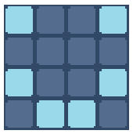

# Starting minesweeper
---

## 1.- creating the field

We will start by creating a grid for our program using arrays. To do this, follow these steps and enter the code below into your `sketch.js` file:

````js
let field;
const scale = 40;

function setup(){
  createCanvas(400, 400);
  field = [
    [0, 0, 0, 0],
    [0, 0, 0, 0],
    [0, 0, 0, 0],
    [0, 0, 0, 0]
  ]
}

function draw(){
  for(let i=0; i<field.length; i++){
    for(let j=0; j<field[i].length; j++){
      square(j*scale, i*scale, scale);
    }
  }
}
````

Here, we are creating an array that contains other arrays, effectively forming a matrix. To access all elements of this matrix, we need to iterate through each element in all of the inner arrays. We accomplish this using a nested `for` loop: one loop to iterate through the outer array and another loop to iterate through each of the inner arrays.

The process works as follows:
|           | j = 0 | j = 1 | j = 2 | j = 3 |
|-----------|-------|-------|-------|-------|
| **i = 0** |   0   |   0   |   0   |   0   |
| **i = 1** |   0   |   0   |   0   |   0   |
| **i = 2** |   0   |   0   |   0   |   0   |
| **i = 3** |   0   |   0   |   0   |   0   |

First, the outer `for` loop iterates through each row in the `field` array. Within each row, the inner `for` loop checks each column. Once the inner loop has processed all columns in the current row, the outer loop moves on to the next row and repeats the process.

The purpose of using a `scale` is to make the squares bigger. Without a `scale`, the squares would only have a width and height of 1 pixel. We also use the `scale` to multiply the x and y positions. For example, if the value of i is 0 and the value of j is 1, we want the square to be drawn to the right of the first square (0, 0). Therefore, its y value should be 0 (0\*`scale`) and its x value should be the exact width of the last square (1\*`scale`). These scaled values correspond to our i and j values (0, 1).

We can now use different values to draw squares in various colors. To achieve this, we will modify the setup and draw functions as follows:

````js
function setup(){
  createCanvas(400, 400);
  field = [
    [1, 0, 0, 1],
    [0, 0, 0, 0],
    [1, 0, 0, 1],
    [0, 1, 1, 0]
  ]
}

function draw(){
for(let i=0; i<field.length; i++){
  for(let j=0; j<field[i].length; j++){
    if(field[i][j] == 0)
      fill("rgb(115, 198, 43)");
    else
      fill("rgb(198, 162, 43)");
    square(j*scale, i*scale, scale);
    }
  }
}
````

Here, you can experiment with various aspects of your program:
* Colors: Try changing the colors used for different values.
* Shapes: Experiment with different shapes besides squares.
* Scale: Adjust the size of the squares or shapes by modifying the scale variable.
* Field: Alter the field array to include different values and patterns.

You can also add additional numbers to the field array and assign unique colors to each number. 

> You can also see how we can use the `if` condition without the need for `{}`. This is only possible when the code within the `if` statement is just one line.

## 2.- Using images

Squares are great, but if we want to make a more complex program, we will need to use images. To use images, we will need to add the p5.js function `preload` to load the images. Then, we can draw the images at our chosen `x, y` positions and with our specified `width` and `height`. Here's a template:

````js
let image1;

function preload(){
  image1 = loadImage("path/to/image.extension");
}

function draw(){
  image(image1, x, y, width, height);
}
````

Let's actually use some sprites. Download the folder containing the sprites and add it to your project's main directory. You can do this by dragging it into VSCode. Then, we can use them:

````js
let field;
const scale = 40;

let off;
let on;

function preload(){
  off = loadImage("sprites/off.png");
  on = loadImage("sprites/on.png");
}


function setup(){
  createCanvas(400, 400);
  noSmooth();
  field = [
    [1, 0, 0, 1],
    [0, 0, 0, 0],
    [1, 0, 0, 1],
    [0, 1, 1, 0]
  ]
}

function draw(){
  for(let i=0; i<field.length; i++){
    for(let j=0; j<field[i].length; j++){
      if(field[i][j] == 0)
        image(off, j*scale, i*scale, scale, scale);
      else
        image(on, j*scale, i*scale, scale, scale);
    }
  }
}
````

We use the `noSmooth` function here so our images don't get blurry. This is because we are using a pixel art style. If you use other types of images, you can choose not to use this function.

Feel free to experiment with different images, sizes, and positions to create the desired visual effect in your program.

## 3.- Using the mouse

Now we can start using the mouse. Instead of having a fixed field, we will change it via user interactions. For this purpose, we will use the `mousePressed` function from p5.js:

````js

// ...

function mousePressed(){
  var x = floor(mouseX/scale);
  var y = floor(mouseY/scale);
  field[y][x] = 1;
}
````

`mouseX` contains the x position of the mouse at the moment it is called, and `mouseY` is the same but for the y position. The function `floor` takes a floating-point number and returns the integer part. For example, `floor(9.1)` returns 9 and `floor(2.9)` returns 2.

By dividing `mouseX` and `mouseY` by the `scale`, we convert the mouse position into grid coordinates that match our field array, allowing us to update the corresponding cell in the grid.

At this point, you should have a program that looks like this:



And when you click on an "off" tile of the field, it changes to "on".

## 4.- Enlarging our field

This is great, but to make a larger field, we want the program to automatically fill the field. This way, we only need to change `fieldH` and `fieldW`. To do this, we will create an array and then create another array inside for each row we want. We will then fill each of these arrays with as many `0`s as our `fieldW`. Your program will look like this:

````js
let field = []; // <-- changed
const scale = 40;
const fieldH = 10;
const fieldW = 20;

let off;
let on;

function preload(){
  off = loadImage("sprites/off.png");
  on = loadImage("sprites/on.png");
}

// -------------changed-------------
function setup(){
  createCanvas(800, 800);
  noSmooth();
  for(let i=0; i<fieldH; i++){
    field[i] = [];
    for(let j=0; j<fieldW; j++){
      field[i][j] = 0;
    }
  }
}
// ---------------------------------

function draw(){
  for(let i=0; i<field.length; i++){
    for(let j=0; j<field[i].length; j++){
      if(field[i][j] == 0)
        image(off, j*scale, i*scale, scale, scale);
      else
        image(on, j*scale, i*scale, scale, scale);
    }
  }
}

function mousePressed(){
  var x = floor(mouseX/scale);
  var y = floor(mouseY/scale);
  field[y][x] = 1;
}
````

At this point, you can try to add mines to the field yourself. Here are some hints to help you:

* Add a new number to represent the mines.
* The function random(0, num) generates a random number between 0 and num. This is a floating-point number, so remember to use the floor function.
* Use a new function to create the mines generator.

If it's too hard, don't worry! We are still starting our journey into programming. The key is to try. Once you are ready, click below to continue.

[adding complexity](minesweeper2.md)