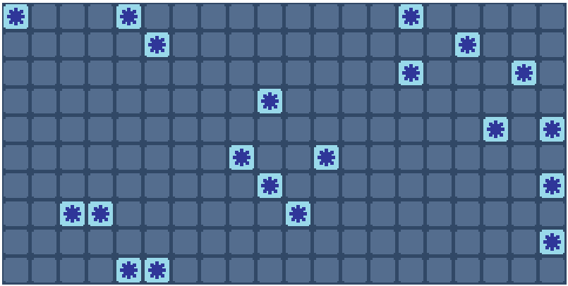

# Adding complexity
---

## 1.- Adding mines

We are going to start by adding mines to our field. To do this, we will create a new function that will add mines to our field at random positions. We are also going to declare a new number to represent the mines on our field. In this case, we will use the number 9.

1. **Declare a New Constant for Mines:**
    * We will use the constant `mine_block` to represent mines in our field.
2. **Create a Function to Generate Mines:**
    * The `generateMines` function will randomly place mines on the field.
3. **Integrate Mine Generation into Setup:**
    * Call the `generateMines` function within `setup` to place mines when the program initializes.

````js
const mine_block = 9;

// ...

function setup(){
  
  // ...

  generateMines(20);
}

function generateMines(num){
  for(let i = 0; i < num; i++){
    let x = floor(random(0, fieldW));
    let y = floor(random(0, fieldH));
    if(field[y][x] == mine_block)
      i--;
    else
      field[y][x] = mine_block;
  }
}
````

The if statement checks if a mine is already at the generated coordinates. If so, it decrements i to ensure the correct number of mines is placed.

Experiment with the number of mines and see how it affects the gameplay. Adjust the field size and mine count to understand how the random placement works. Remember, the key is to keep practicing and experimenting.

## 2.- Losing when you click a mine

Now that we have mines in our game, we need to implement functionality to restart the game when a mine is clicked. To do this, we can simply call our `setup` function when a mine is clicked.

````js
function mousePressed(){
  var x = floor(mouseX/scale);
  var y = floor(mouseY/scale);
  if(field[y][x] == mine_block)
    setup();
  else
    field[y][x] = 1;
}
````

If the clicked tile is a mine (`field[y][x] == mine_block`), the game calls `setup()` to restart.

## 3.- Creating a mask

At this point, you should have a game that looks like this:


However, we don't want to know where the mines are initially. To hide this information, we'll create a mask. The mask will be a matrix of the same size as our field and will determine which tiles should be visible. We'll also move our code to show the different images to a new function.

````js
let field = [];
let mask = []; // <-- new
const scale = 40;
const fieldH = 10;
const fieldW = 20;

const mine_block = 9;

let off;
let on;
let mine;

function preload(){
  off = loadImage("sprites/off.png");
  on = loadImage("sprites/on.png");
  mine = loadImage("sprites/mine.png");
}

function setup(){
  createCanvas(800, 800);
  noSmooth();
  for(let i=0; i<fieldH; i++){
    field[i] = [];
    mask[i] = []; // <-- new
    for(let j=0; j<fieldW; j++){
      field[i][j] = 0;
      mask[i][j] = 0; // <-- new
    }
  }
  generateMines(20);
}

// --------------------changed---------------------
function draw(){
  for(let i=0; i<field.length; i++){
    for(let j=0; j<field[i].length; j++){
      if(mask[i][j] == 0)
        image(off, j*scale, i*scale, scale, scale);
      else if(mask[i][j] == 1)
        show(i, j);
    }
  }
}
// -----------------------------------------------

// ----------------------new----------------------
function show(x, y){
  switch(field[x][y]){
    case 0:
      image(on, y*scale, x*scale, scale, scale);
      break;
    case 9:
      image(mine, y*scale, x*scale, scale, scale);
      break;
  }
}
// -----------------------------------------------

function mousePressed(){
  var x = floor(mouseX/scale);
  var y = floor(mouseY/scale);
  if(field[y][x] == mine_block)
    setup();
  else
    mask[y][x] = 1; // <-- changed
}

function generateMines(num){
  for(let i = 0; i < num; i++){
    let x = floor(random(0, fieldW));
    let y = floor(random(0, fieldH));
    if(field[y][x] == mine_block)
      i--;
    else
      field[y][x] = mine_block;
  }
}
````

* Mask Array:
  * We introduced a new array `mask` that is of the same size as our `field`.
  * Each position in the `mask` array corresponds to a tile in the `field` array.
  * If `mask[y][x]` is 0, the tile is hidden. If it is 1, the tile is visible.
* Updated Draw Function:
  * The `draw` function now checks the `mask` array to determine whether to show a tile or not.
  * If `mask[i][j]` is 0, the tile is hidden (off).
  * If `mask[i][j]` is 1, the `show` function is called to display the tile.
* New Show Function:
  * The `show` function uses a `switch` statement to display the appropriate image based on the value in the `field` array.
  * The `switch` statement is more efficient than a chain of `if` statements when dealing with multiple conditions.

With these changes, we now don't see a tile until we click on it. However, it might be useful to know the positions of the mines for development purposes. To achieve this, we can either:

1. Change the initialization of our `mask` to be all 1s, which will display all the tiles initially.
2. Open the console and type in the name of our `field` variable to see the matrix and all its information.

> You can type the name of any variable in the console to see its value. For matrices, you can use `console.table(matrix_name)` to display them in a more readable table format. Try it out with the `field` variable.

## 4.- Adding flags

Now that we have a mask, we can use flags without losing the data in the original field. For this, we just need to add a new number to represent the flags on the mask and look for it in the `draw` function:

````js

// ...

let flag;

// ...

function preload(){
  
  // ...

  flag = loadImage("sprites/flag.png");
}

function draw(){
  for(let i=0; i<field.length; i++){
    for(let j=0; j<field[i].length; j++){
      if(mask[i][j] == 0)
        image(off, j*scale, i*scale, scale, scale);
      else if(mask[i][j] == 1)
        show(i, j);
      else if(mask[i][j] == 2)  // <-- new
        image(flag, j*scale, i*scale, scale, scale);
    }
  }
}
````

Once we have that, we can look for the right-click of the mouse, and when that is pressed, we check if the mask of that position is already a flag. If it is, we remove it from the mask; if it's not, we add it:

````js
function mousePressed(){
  var x = floor(mouseX/scale);
  var y = floor(mouseY/scale);
  if(mouseButton == LEFT && mask[y][x] != 2){
    if(field[y][x] == mine_block)
      setup();
    else
      mask[y][x] = 1;
  }
  else if(mouseButton == RIGHT){
    if(mask[y][x] == 2)
      mask[y][x] = 0;
    else if(mask[y][x] == 0)
      mask[y][x] = 2;
  }
}
````

`mask[y][x] != 2` is used to ensure that when you left-click a tile with a flag on it, it will not change the mask nor reset the game if it’s a mine. This prevents any action on flagged tiles, maintaining the integrity of the flagging system.

Now, you can flag tiles by right-clicking on them, making it easier to mark suspected mines without revealing them.

## 5.- Adding numbers

Now that we have mines and flags, we need to add numbers to indicate the count of adjacent mines for each tile. This will help us understand the proximity of mines. To achieve this, we will iterate through each tile and check its 8 surrounding tiles, incrementing its number if any of those tiles contain a mine.

1. Create the `enumerate` function:
This function will iterate through the field, checking the adjacent tiles for mines and incrementing the count accordingly.

2. Define offsets for bounds checking:
To avoid errors when checking tiles at the edges, we use offsets (`od`, `or`, `ol`, `ou`) to limit the range of adjacent tiles to check.

````js
function enumerate(){
  for(let i = 0; i < field.length; i++){
    for(let j = 0; j < field[i].length; j++){
      let od = 1, or = 1;
      let ol = -1, ou = -1;
      if(field[i][j] != mine_block){
        if(j == 0){
          ol = 0;
        }
        else if(j == fieldW-1){
          or = 0;
        }
        if(i == 0){
          ou = 0;
        }
        else if(i == fieldH-1){
          od = 0;
        }
        rounded(j, i, ou, od, ol, or);
      }
    }
  }
}
````
Explanation of Offsets:
* `od` (offset down) and `or` (offset right) are initialized to 1.
* `ol` (offset left) and `ou` (offset up) are initialized to -1.
* These offsets help in determining the range of adjacent tiles to check without going out of bounds.

Offsets Adjustment:
* For the first column (`j == 0`), `ol` is set to 0 to avoid checking tiles to the left.
* For the last column (`j == fieldW - 1`), `or` is set to 0 to avoid checking tiles to the right.
* For the first row (`i == 0`), `ou` is set to 0 to avoid checking tiles above.
* For the last row (`i == fieldH - 1`), `od` is set to 0 to avoid checking tiles below.

Let's consider an example with `od = 1`, `or = 1`, `ol = 0`, and `ou = -1`:
* T is the tile we are counting adjacent mines for.
* 0 represents tiles that are not checked.
* 1 represents tiles that are checked.

|  0  |  1  |  1  |
|-----|-----|-----|
|**0**|**T**|**1**|
|**0**|**1**|**1**|

The `rounded` function will help us count the mines surrounding each tile. We'll iterate through the adjacent tiles, using the previously defined offsets to avoid out-of-bound errors. If one of the adjacent tiles is a mine, we'll increment the count of the current tile:

````js
function rounded(x, y, ou, od, ol, or){
  for(let i = ou; i <= od; i++){
    for(let j = ol ; j <= or; j++){
      if(field[y+i][x+j] == mine_block){
        field[y][x]++;
      }
    }
  }
}
````

After generating the mines, we call the `enumerate` function to populate the field with the count of adjacent mines.

````js
function setup(){
  
  // ...

  generateMines(20);
  enumerate();
}
````

To see the current state of the field with mines and numbers, you can open the console in the browser and type `console.table(field)`.

## 6.- Seeing the numbers

Using the console is great, but we will want to see the number of adjacent mines just by clicking on a tile. To do this, we need to use all of our sprites.

First, we load the sprites for the numbers:
````js

// ...

let one;
let two;
let three;
let four;
let five;
let six;
let seven;
let eight;

function preload(){
  off = loadImage("sprites/off.png");
  on = loadImage("sprites/on.png");
  mine = loadImage("sprites/mine.png");
  flag = loadImage("sprites/flag.png");
  one = loadImage("sprites/one.png");
  two = loadImage('sprites/two.png');
  three = loadImage('sprites/three.png');
  four = loadImage('sprites/four.png');
  five = loadImage('sprites/five.png');
  six = loadImage('sprites/six.png');
  seven = loadImage('sprites/seven.png');
  eight = loadImage('sprites/eight.png');
}
````

Next, we update the `show` function to display the correct image based on the number of adjacent mines:

````js
function show(x, y){
  switch(field[x][y]){
    case 0:
      image(on, y*scale, x*scale, scale, scale);
      break;
    case 1:
      image(one, y*scale, x*scale, scale, scale);
      break;
    case 2:
      image(two, y*scale, x*scale, scale, scale);
      break;
    case 3:
      image(three, y*scale, x*scale, scale, scale);
      break;
    case 4:
      image(four, y*scale, x*scale, scale, scale);
      break;
    case 5:
      image(five, y*scale, x*scale, scale, scale);
      break;
    case 6:
      image(six, y*scale, x*scale, scale, scale);
      break;
    case 7:
      image(seven, y*scale, x*scale, scale, scale);
      break;
    case 8:
      image(eight, y*scale, x*scale, scale, scale);
      break;
    case 9:
      image(mine, y*scale, x*scale, scale, scale);
      break;
  }
}
````

Now, when you click on a tile, it will display the number of adjacent mines.

## 7.- Revealing all the tiles

Now the only thing that's left is to reveal all the tiles that are not a mine or a number once we click on a tile. We have to take into account two things: we will need to show the numbers adjacent to the tiles we reveal, and we also want to see the corners of the piece we are revealing. We are going to make a new function for this purpose:

````js
function revelate(y, x){
  // If the cell is not visible (mask[y][x] == 0) and it is a normal tile (field[y][x] == 0)
  if(mask[y][x] == 0 && field[y][x] == 0){
    // First, set the mask to 1 to show the tile
    mask[y][x] = 1;

    // Then, check the four adjacent tiles and recursively call the function
    // only if it is a normal tile, otherwise just reveal the tile.
    // This is to stop the recursive calls once we find a number
    if(x-1 > -1 && field[y][x-1] != mine_block){
      if(field[y][x-1] == 0)
        revelate(y, x-1);
      else
        mask[y][x-1] = 1;
    }
    if(y+1 < fieldH && field[y+1][x] != mine_block){
      if(field[y+1][x] == 0)
        revelate(y+1, x);
      else
        mask[y+1][x] = 1;
    }
    if(x+1 < fieldW && field[y][x+1] != mine_block){
      if(field[y][x+1] == 0)
        revelate(y, x+1);
      else
        mask[y][x+1] = 1;
    }
    if(y-1 > -1 && field[y-1][x] != mine_block){
      if(field[y-1][x] == 0)
        revelate(y-1, x);
      else
        mask[y-1][x] = 1;
    }

    // Once we have checked the four adjacent tiles, we have to reveal the corners.
    // For that, we only reveal them if they are a number (not a mine nor a normal tile)
    if(x-1 > -1 && y+1 < fieldH && field[y+1][x-1] != mine_block && field[y+1][x-1] != 0)
      mask[y+1][x-1] = 1;
    if(x-1 > -1 && y-1 > -1 && field[y-1][x-1] != mine_block && field[y-1][x-1] != 0)
      mask[y-1][x-1] = 1;
    if(x+1 < fieldW && y+1 < fieldH && field[y+1][x+1] != mine_block && field[y+1][x+1] != 0)
      mask[y+1][x+1] = 1;
    if(x+1 < field && y-1 > -1 && field[y-1][x+1] != mine_block && field[y-1][x+1] != 0)
      mask[y-1][x+1] = 1;
  }
  // If it's not a normal tile but also not a mine, just reveal it.
  // This is to prevent recursive calls when clicking on a number,
  // so it just reveals the clicked tile.
  else if(mask[y][x] == 0 && field[y][x] != mine_block){
    mask[y][x] = 1;
  }
}
````

* Left (x - 1)
* Down (y + 1)
* Right (x + 1)
* Up (y - 1)
* Down-left (y + 1, x - 1)
* Up-left (y - 1, x - 1)
* Down-right (y + 1, x + 1)
* Up-right (y - 1, x + 1)

> Notice how we are calling the function inside itself. This is called recursion, and it's a very interesting concept in programming and math. In future projects, we will be using it.

Once we have our function done, we just need to call it when we left-click on a tile:

````js
function mousePressed(){
  var x = floor(mouseX/scale);
  var y = floor(mouseY/scale);
  if(mouseButton == LEFT && mask[y][x] != 2){
    if(field[y][x] == mine_block)
      setup();
    else
      revelate(y, x); // <-- changed
  }
  else if(mouseButton == RIGHT){
    if(mask[y][x] == 2)
      mask[y][x] = 0;
    else if(mask[y][x] == 0)
      mask[y][x] = 2;
  }
}
````

## 8.- Applying a style

Now we have a completely working Minesweeper game, but to make it look better, we will apply a very basic CSS style. If you are interested in styling your code, you can find a lot of information online.

First, we are going to get rid of the right-click context menu and move the canvas to the center of the screen:

````js
function setup(){
  let canvas = createCanvas(fieldW*scale, fieldH*scale);
  canvas.position((windowWidth - width) / 2, (windowHeight - height) / 2);

  canvas.elt.addEventListener('contextmenu', function(e) {
    e.preventDefault();
  });
  
  // ...

}
````

Then we will remove the margin that the canvas and the body have:

````html
<!DOCTYPE html>
<html lang="en">
<head>
    <meta charset="UTF-8">
    <meta name="viewport" content="width=device-width, initial-scale=1.0">
    <title>busca minas</title>
    <!-- -----new----- -->
    <style>
      body {
        margin: 0;
      }
      canvas {
        display: block;
      }
    </style>
    <!-- ------------- -->
</head>
<body>
    <script src="https://cdnjs.cloudflare.com/ajax/libs/p5.js/1.4.0/p5.js"></script>
    <script src="sketch.js"></script>
</body>
</html>
````

The completed code will look like this:

````js
let field = [];
let mask = [];
const scale = 40;
const fieldH = 10;
const fieldW = 20;

const mine_block = 9;

let off;
let on;
let mine;
let flag;
let one;
let two;
let three;
let four;
let five;
let six;
let seven;
let eight;

function preload(){
  off = loadImage("sprites/off.png");
  on = loadImage("sprites/on.png");
  mine = loadImage("sprites/mine.png");
  flag = loadImage("sprites/flag.png");
  one = loadImage("sprites/one.png");
  two = loadImage('sprites/two.png');
  three = loadImage('sprites/three.png');
  four = loadImage('sprites/four.png');
  five = loadImage('sprites/five.png');
  six = loadImage('sprites/six.png');
  seven = loadImage('sprites/seven.png');
  eight = loadImage('sprites/eight.png');
}

function setup(){
  let canvas = createCanvas(fieldW*scale, fieldH*scale);
  canvas.position((windowWidth - width) / 2, (windowHeight - height) / 2);

  canvas.elt.addEventListener('contextmenu', function(e) {
    e.preventDefault();
  });
  noSmooth();
  for(let i=0; i<fieldH; i++){
    field[i] = [];
    mask[i] = [];
    for(let j=0; j<fieldW; j++){
      field[i][j] = 0;
      mask[i][j] = 0;
    }
  }
  generateMines(20);
  enumerate();
}

function draw(){
  for(let i=0; i<field.length; i++){
    for(let j=0; j<field[i].length; j++){
      if(mask[i][j] == 0)
        image(off, j*scale, i*scale, scale, scale);
      else if(mask[i][j] == 1)
        show(i, j);
      else if(mask[i][j] == 2)
        image(flag, j*scale, i*scale, scale, scale);
    }
  }
}

function show(x, y){
  switch(field[x][y]){
    case 0:
      image(on, y*scale, x*scale, scale, scale);
      break;
    case 1:
      image(one, y*scale, x*scale, scale, scale);
      break;
    case 2:
      image(two, y*scale, x*scale, scale, scale);
      break;
    case 3:
      image(three, y*scale, x*scale, scale, scale);
      break;
    case 4:
      image(four, y*scale, x*scale, scale, scale);
      break;
    case 5:
      image(five, y*scale, x*scale, scale, scale);
      break;
    case 6:
      image(six, y*scale, x*scale, scale, scale);
      break;
    case 7:
      image(seven, y*scale, x*scale, scale, scale);
      break;
    case 8:
      image(eight, y*scale, x*scale, scale, scale);
      break;
    case 9:
      image(mine, y*scale, x*scale, scale, scale);
      break;
  }
}

function mousePressed(){
  var x = floor(mouseX/scale);
  var y = floor(mouseY/scale);
  if(mouseButton == LEFT && mask[y][x] != 2){
    if(field[y][x] == mine_block)
      setup();
    else
      revelate(y, x);
  }
  else if(mouseButton == RIGHT){
    if(mask[y][x] == 2)
      mask[y][x] = 0;
    else if(mask[y][x] == 0)
      mask[y][x] = 2;
  }
}

function generateMines(num){
  for(let i = 0; i < num; i++){
    let x = floor(random(0, fieldW));
    let y = floor(random(0, fieldH));
    if(field[y][x] == mine_block)
      i--;
    else
      field[y][x] = mine_block;
  }
}

function enumerate(){
  for(let i = 0; i < field.length; i++){
    for(let j = 0; j < field[i].length; j++){
      let od = 1, or = 1;
      let ol = -1, ou = -1;
      if(field[i][j] != mine_block){
        if(j == 0){
          ol = 0;
        }
        else if(j == fieldW-1){
          or = 0;
        }
        if(i == 0){
          ou = 0;
        }
        else if(i == fieldH-1){
          od = 0;
        }
        rounded(j, i, ou, od, ol, or);
      }
    }
  }
}

function rounded(x, y, ou, od, ol, or){
  for(let i = ou; i <= od; i++){
    for(let j = ol ; j <= or; j++){
      if(field[y+i][x+j] == mine_block){
        field[y][x]++;
      }
    }
  }
}

function revelate(y, x){
  if(mask[y][x] === 0 && field[y][x] === 0){
    mask[y][x] = 1;
    if(x-1 > -1 && field[y][x-1] != mine_block){
      if(field[y][x-1] === 0)
        revelate(y, x-1);
      else
      mask[y][x-1] = 1;
    }
    if(y+1 < fieldH && field[y+1][x] != mine_block){
      if(field[y+1][x] === 0)
        revelate(y+1, x);
      else
      mask[y+1][x] = 1;
    }
    if(x+1 < fieldW && field[y][x+1] != mine_block){
      if(field[y][x+1] === 0)
        revelate(y, x+1);
      else
      mask[y][x+1] = 1;
    }
    if(y-1 > -1 && field[y-1][x] != mine_block){
      if(field[y-1][x] === 0)
        revelate(y-1, x);
      else
      mask[y-1][x] = 1;
    }
    if(x-1 > -1 && y+1 < fieldH && field[y+1][x-1] != mine_block && field[y+1][x-1] != 0)
      mask[y+1][x-1] = 1;
    if(x-1 > -1 && y-1 > -1 && field[y-1][x-1] != mine_block && field[y-1][x-1] != 0)
      mask[y-1][x-1] = 1;
    if(x+1 < fieldW && y+1 < fieldH && field[y+1][x+1] != mine_block && field[y+1][x+1] != 0)
      mask[y+1][x+1] = 1;
    if(x+1 < field && y-1 > -1 && field[y-1][x+1] != mine_block && field[y-1][x+1] != 0)
      mask[y-1][x+1] = 1;
  }
  else if(mask[y][x] === 0 && field[y][x] != mine_block){
    mask[y][x] = 1;
  }
}
````

With that, we have completed our first coding project! This project covers many complex programming concepts. If you haven't understood everything, don't worry. Programming can be very challenging, but the key is to keep practicing. I am working on future projects that will be easier. Until then, you can keep practicing with your own projects and referring to online documentation.